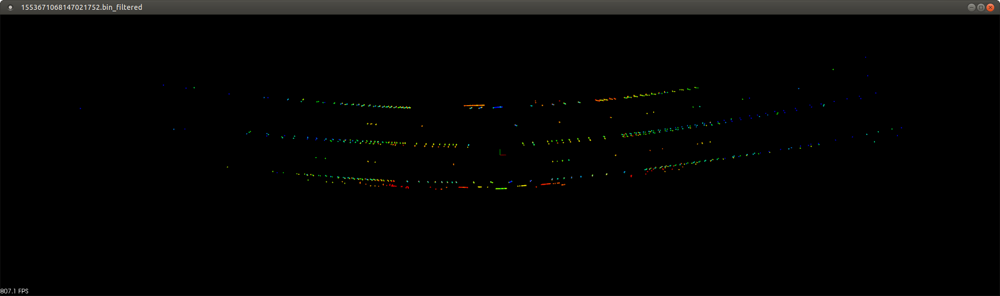
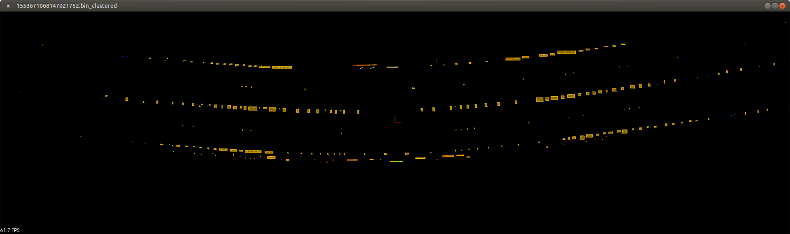
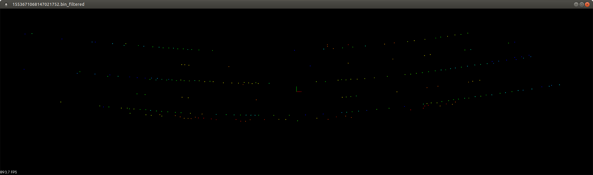
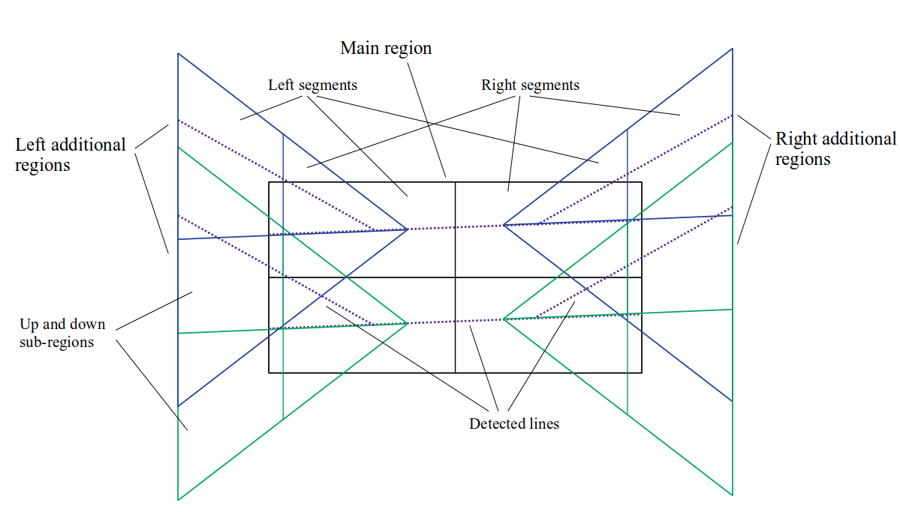
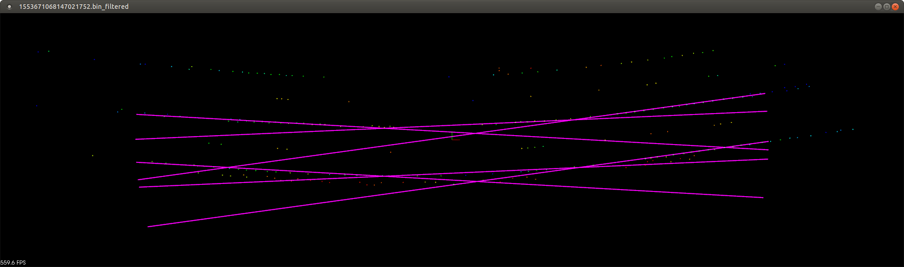
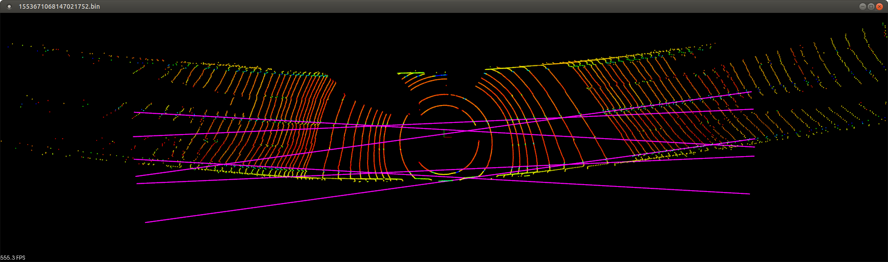
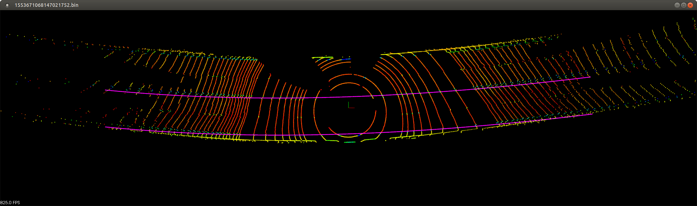

# 1. Building
A compiler that supports C++17 and the CMake build system are required.  
The Eigen 3 library is needed for building. On Ubuntu, it can be installed by executing:
```
sudo apt install libeigen3-dev
```
The PCL library is used for point cloud visualization and result visualization. It is not applied in the logic part;
its installation is only necessary when building the project with visualization enabled. By default, visualization is enabled.
```
sudo apt install libpcl-dev
```
Building with visualization enabled (PCL library required):
```
cd cpp_lane_detector
mkdir build
cd build
cmake .. -DCMAKE_BUILD_TYPE=Release
cmake --build . --target all -- -j 12
```
To build without visualization (PCL library not needed), pass the `-DWITH_VISUALIZATION=OFF` flag to CMake:
```
cd cpp_lane_detector
mkdir build
cd build
cmake .. -DCMAKE_BUILD_TYPE=Release -DWITH_VISUALIZATION=OFF
cmake --build . --target all -- -j 12
```
# 2. Launch
```
./cpp_lane_detector [path to a directory with point clouds] [path to an output directory to store results]
```
The program will sequentially process each file from the point cloud directory, saving polynomial coefficients for each
into a text file in the results directory.  
If the program was built with visualization, it displays a window with the point cloud and polynomial after processing each file. 
Closing the window processes and visualizes the next file.

# 3. Algorithm
## 3.1. Point Cloud Preprocessing
Before detecting lines, the point cloud undergoes preprocessing to reduce its dimensionality and keep only those points that may relate to road markings.

### 3.1.1. Selecting Points Relating to Road Markings
- For each LiDAR ray, the median intensity and the standard deviation from the median intensity are calculated.
- From each ray, only those points are selected whose intensity exceeds the median by a certain threshold proportional to the standard deviation of intensity in that ray.



### 3.1.2. Clustering Points Related to Road Markings
- For the points selected in the previous stage, clustering is performed using Euclidean Clustering.
  Euclidean clustering algorithmically groups points in a point cloud into clusters based on their Euclidean distance, iteratively expanding clusters
  by including neighboring points within a specified distance threshold. This approach relies on spatial proximity
  without requiring prior knowledge of cluster numbers, emphasizing an iterative, distance-based grouping mechanism for data segmentation.
- To simplify the complexity of finding nearest neighbors, the point cloud is placed into a [k-d tree](https://en.wikipedia.org/wiki/K-d_tree) data structure.
- It is assumed that clusters containing points related to road markings contain relatively few points.
  Clusters containing too many points are discarded.



### 3.1.3. Replacing Points with Cluster Centroids
- To reduce dimensionality, each cluster is replaced with a single point - the centroid.

### 3.1.4. Selecting Points Only Within the Region of Interest
- The cloud of cluster centroid points is trimmed by a specific radius and height
- Another clustering is performed with a larger distance within the cluster (about 15 meters).
  If the result contains more than one cluster, the largest cluster is selected, and points from other clusters are considered irrelevant.

 

## 3.2. Line Detection
The second stage is line detection on the preprocessed point cloud.  
The algorithm is based on dividing the point cloud into several regions of interest, searching for straight lines in each region,
and then approximating the points along the found straight lines with a third-order polynomial.  
Line construction is carried out in the upper and lower segments of the point cloud, followed by a search for the closest to parallel pair of lines.  
In this case, the lower segment refers to a set of points below the central line (one edge of the lane),
and the upper segment refers to a set of points above it (the other edge of the lane). 

 

For simplification of calculations at this stage, it is assumed that all points are approximately in the plane and the height is zero.

### 3.2.1. Finding the Main Direction of the Road
- [Principal component analysis (PCA)](https://en.wikipedia.org/wiki/Principal_component_analysis)
  is used to find the main direction of the road.


### 3.2.2. Rotating the Point Cloud to Orient it Along the Main Direction of the Road.

### 3.2.3. Selecting Points of the Main Region - Near the Origin
- The main region is divided into upper and lower segments, and the upper and lower segments are divided into left and right.
- Lines are searched for separately in the upper and lower segment between points taken from the left and right parts.

### 3.2.4. Conducting the Search for Straight Lines in the Upper and Lower Segments of the Main Region
- In the upper and lower segments, all pairs of points are iterated through, where one point lies in the left half of the segment, and the second - in the right.
- Straight lines are constructed through the selected pairs of points.
- Lines with too much angle are discarded.
- Lines passing too close or too far from the origin are discarded.
- For each line, the number of points located near it is calculated. This number determines the line's score.
- In the upper and lower segment, N lines with the highest score are selected.
- Since after preprocessing, each of the segments contains relatively few points, it is possible to iterate over all their pairs (`O(m*n)`).
  With an increase in the number of points, it may be necessary to switch to a method based on [RANSAC](https://en.wikipedia.org/wiki/Random_sample_consensus).

### 3.2.5. Selecting Two Most Suitable Parallel Lines from the Upper and Lower Segment of the Main Region
- Among the selected lines from the upper and lower segments, all pairs are iterated through.
- A pair of lines is selected, the cosine of the angle between the normals to which is maximal.
- Pairs of lines located too close to each other (having close intersection coordinates with the Y-axis) are discarded.

### 3.2.6. Selection of Points from Additional Regions - From the Left Edge of the Point Cloud and from the Right Edge of the Point Cloud
- Points of the additional regions are selected to the left and right of the main region
- Additional regions are narrow near the origin and expand as they move away from the origin
- Additional regions are divided into sub-regions - above and below the lines found in the main region

### 3.2.7. Searching for Pairs of Straight Lines in Additional Regions
- In each of the sub-regions, straight lines are searched for, similarly to section 3.2.4.
- Distinctive aspects include checking the selected lines to ensure they do not form too large an angle
  with the corresponding line from the main region, and that they intersect this line in the vicinity of the sub-region.
- Lines from the upper and lower sub-region of each region are combined into a common list according to their scores.
- In the left and right additional regions, the search for the best parallel lines from the top and bottom parts is conducted 
  according to the steps from section 3.2.5.

### 3.2.8. Comparing the Quality of Found Pairs of Lines in Additional Regions with the Quality of Line Pairs from the Main Region in These Regions
- The total score of pairs of lines from the additional regions is compared with the total score in these regions for lines from the main
  region. If the score of lines from the additional region does not exceed twice the score of lines from the main region, then the lines from the additional
  region are discarded, and lines from the main region are used instead.

### 3.2.9. Rotating the Set of Points Located Along the Found Lines to Return Them to the Original Orientation of the Road.

### 3.2.10. Approximating the Set of Points Located Along the Lines with a Third-Order Polynomial.
- Points lying on straight lines from various segments are generated.
  For the main segment, points are generated in the middle, for additional segments - points closer to the edges of the point cloud.
- The points are approximated with a third-order polynomial using the least squares metho

  
  
  
## 4. Ideas for Further Improvement
### 4.1. Finer Algorithm Parameter Tuning

### 4.2. Moving Configuration Parameters to a Configuration File
- Add a configuration file with parameter sections for different stages of the algorithm's operation
- Read the configuration file in the program
- 
### 4.3. Parallelization
- Many elements of the algorithm can be relatively easily parallelized, from the preprocessing process to the line search process

Barashkov A.A., 2024