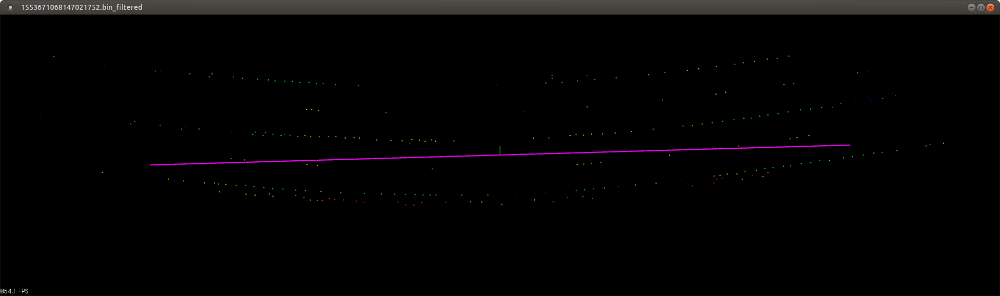

# 1. Сборка
Необходим компилятор, поддерживающий C++17 и система сборки CMake.  
Для сборки необходима библиотека Eigen 3. На Ubuntu её можно установить, выполнив
```
sudo apt install libeigen3-dev
```
Для визуализации облака точек и результата используется библиотека PCL. В части, отвечающей за логику, она не применяется, её установка необходима только при сборке проекта с включённой визуализацией. По умолчанию визуализация включена.
```
sudo apt install libpcl-dev
```
Сборка с включённой визуализацией (необходима библиотека PCL):
```
cd cpp_lane_detector
mkdir build
cd build
cmake .. -DCMAKE_BUILD_TYPE=Release
cmake --build . --target all -- -j 12
```
Для сборки без визуализации (библиотека PCL не нужна) необходимо передать в CMake флаг `-DWITH_VISUALIZATION=OFF`:
```
cd cpp_lane_detector
mkdir build
cd build
cmake .. -DCMAKE_BUILD_TYPE=Release -DWITH_VISUALIZATION=OFF
cmake --build . --target all -- -j 12
```
# 2. Запуск
```
./cpp_lane_detector [path to a directory with point clouds] [path to an output directory to store results]
```
Программа последовательно обработает каждый файл из каталога с облаком точек и сохранит коэффициенты полиномов для каждого из них в текстовый файл в каталог для текстовых файлов с результатами.  
Если программа была собрана с включённой визуализацией, после обработки каждого файла на экран будет выводиться окно с облаком точек и изображением найденного полинома. После закрытия окна будет производиться обработка следующего файла и снова показываться окно с его визуализацией.
# 3. Алгоритм
## 3.1. Предобработка облака точек
Перед поиском линий осуществляется предобработка облака точек с целью уменьшить его размерность и оставить только те точки, которые могут относиться к линиям разметки.
### 3.1.1. Выбор точек, которые могут относиться к линиям дорожной разметки
- Для каждого луча лидара осуществляется поиск медианной интенсивности и среднеквадратического отклонения интенсивности от медианы.
- Из каждого луча выбираются только те точки, у которых интенсивность превышает медиану на определённый порог, пропорциональный среднеквадратическому отклонению интенсивности в данном луче.  

 
### 3.1.2. Кластеризация точек, относящихся к дорожной разметке
- Для выбранных точек на предыдущем этапе осуществляется кластеризация, используется Euclidian Clustering.
  Euclidean clustering algorithmically groups points in a point cloud into clusters based on their Euclidean distance, iteratively expanding clusters by including neighboring points within a specified distance threshold. This approach relies on spatial proximity
  without requiring prior knowledge of cluster numbers, emphasizing an iterative, distance-based grouping mechanism for data segmentation.
- Для упрощения сложности поиска ближайших соседей облако точек помещается в структуру данных [k-d tree](https://en.wikipedia.org/wiki/K-d_tree)
- Предполагаются, что кластеры, содержащие точки, относящиеся к линии разметки, содержат относительно немного точек.
  Кластеры, содержащие слишком много точек, отбрасываются

 
### 3.1.3. Замена точек на центры масс найденных кластеров
- Для уменьшения размерности каждый кластер заменяется на одну точку - центр масс

### 3.1.4. Выбор точек, находящихся только внутри региона интереса
- Облако точек-центров масс кластеров обрезается по определённому радиусу и определённой высоте
- Проводится повторная кластеризация с большим расстоянием внутри кластера (порядка 15 метров). Если в результате получается больше одного кластера, выбирается самый большой кластер, а точки из остальных кластеров считаются не релевантными.

 
## 3.2. Поиск линий
Вторым этапом является поиск линий на предобработанном облаке точек.  
Основу алгоритма составляет разбиение облака точек на несколько регионов интереса, поиск прямых линий в каждом из регионов,
а затем аппроксимация точек вдоль найденных прямых полиномом третьего порядка.  
Построение линий осуществляется в верхних и нижних сегментах облака точек, а затем осуществляется поиск наиболее близкой к параллельной пары линий.  
В данном случае под нижним сегментом понимается набор точек ниже центральной линии (один край полосы),
а под верхним - набор точек выше неё (другой край полосы).  

 

С целью упрощения вычислений на данном этапе считается, что все точки приблизительно находятся в плоскости и высота является нулевой.
### 3.2.1. Нахождение главного направления дороги
- Для нахождения главного направления дороги применяется [Principal component analysis (PCA)](https://en.wikipedia.org/wiki/Principal_component_analysis)


### 3.2.2. Поворот облака точек с целью его ориентации вдоль главного направления дороги.
### 3.2.3. Выбор точек главного региона - около начала координат
- Главный регион разбивается на верхний и нижний сегменты, а верхний и нижний сегменты разбиваются на левый и правый.
- Линии ищутся отдельно в верхнем и нижнем регионе между точками, которые берутся из левого и правого регионов.
### 3.2.4. Осуществление поиска прямых линий в верхнем и нижнем сегментах главного региона
- В верхних и нижних сегментах перебираются все пары точек, где одна точка лежит в левой половине сегмента, а вторая - в правой.
- Через отобранные пары точек строятся прямые линии
- Линии, имеющие слишком большой угол наклона, отбрасываются
- Линии, проходящие слишком близко или слишком далеко от начала координат, отбрасываются
- Для каждой прямой считается количество точек, находящихся вблизи неё. Это число определяет score линии.
- В верхнем и нижнем сегменте отбирается по N линий с самым большим score
- Т.к. после предобработки каждый из сегментов содержит относительно немного точек, возможно перебрать все их пары
  (`O(m*n)`). При увеличении числа точек, может потребоваться перейти к методу, основанному на [RANSAC](https://en.wikipedia.org/wiki/Random_sample_consensus).
### 3.2.5. Выбор двух наиболее подходящих параллельных линий из верхнего и нижнего сегмента главного региона
- Среди отобранных линий из верхнего и нижнего секторов перебираются все пары
- Выбирается пара линий, косинус угла между нормалями к которым максимален
- Отбрасываются линии, находящиеся слишком близко друг к другу (имеющие близкие координаты пересечения с осью Y)
### 3.2.6. Выбор точек дополнительных регионов - с левого края облака точек и с правого края облака точек
- Слева и справа от основного региона выбираются точки дополнительного региона
- Дополнительные регионы являются узкими около начала координат и расширяются по мере удаления от начала координат
- Дополнительные регионы делятся на под-регионы - сверху и снизу прямых, найденных в основном регионе
### 3.2.7. Поиск пар прямых линий в дополнительных регионах
- В каждом из под-регионов ищутся прямые линии, аналогично пункту 3.2.4.
- Отличительными особенностями является проверка для подбираемых линий на то, чтобы они не образовывали слишком большой угол
  с соответствующей линией из основного региона, а также, чтобы они пересекали эту линию в окрестности под-региона.
- Линии верхнего и нижнего под-региона каждого региона объединяются в общий список в соответствии со своими score.
- В левом и правом дополнительных регионах осуществляется поиск лучших параллельных прямых из верхней и нижней части 
  в соответствии с шагами из пункта 3.2.5.
### 3.2.8. Сравнение качества найденных пар прямых в дополнительных регионах с качеством в этих регионах пары линий из главного региона
- Суммарный score пар прямых из дополнительных регионов сравнивается с суммарным score в этих регионах для прямых из основного
  региона. Если score прямых из дополнительного региона не превышает в 2 раза score прямых из основного, то прямые из дополнительного
  региона отбрасываются, вместо них используются прямые из основного региона.
### 3.2.9. Поворот набора точек, находящихся вдоль найденных прямых, с целью их возвращения в исходную ориентацию дороги.
### 3.2.10. Аппроксимация набора точек, находящихся вдоль прямых полиномом третьего порядка.
- Отбираются точки, находящиеся около прямых соответствующих сегментах
- Точки аппроксимируются полиномом третьего порядка при помощи метода наименьших квадратов


 
 
## 4. Идеи для дальнейшего улучшения
### 4.1. Более тонкая настройка параметров алгоритма
### 4.2. Вынесение настроечных параметров в файл конфигурации
- Добавить файл конфигурации с разделами параметров для различных этапов работы алгоритма
- Считывать в программе файл конфигурации
### 4.3. Параллелизация
- Многие элементы алгоритма можно относительно несложно параллелизировать, как из процесса предобработки, так и из процесса поиска линий

Barashkov A.A., 2024